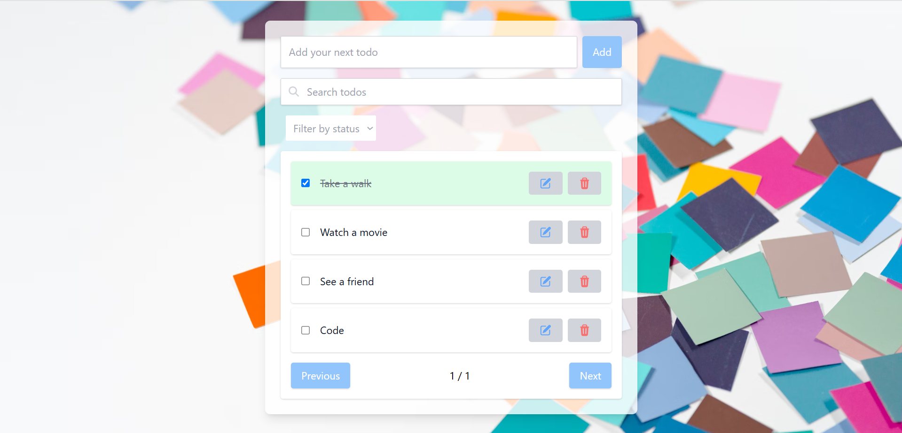

# My Todo App
My Todo App is a lightweight task management tool that helps users organize their tasks with features like task creation, completion tracking, and filtering.

## Preview

## Tech Stack

- Frontend: JavaScript, React, Redux, Tailwind CSS
- Containerization: Docker
- Testing (e2e): Playwright 

## Features
- add a todo
- delete a todo
- edit a todo
- mark todo as completed/uncompleted
- search todos by name
- filter todos by status (completed or uncompleted)
- navigate between multiple pages (pagination)

## Installation & Setup

### Option 1: Run with Docker
#### Prerequisites:
- Docker Desktop installed locally

#### Run the following command to start the application:
  docker compose up

#### View the test report by running the following command:
  npx playwright show-report

### **Option 2: Install manually**
#### Install dependencies:
  npm install

#### Start the development server:
  npm run dev

#### Run E2E tests:
  npx playwright test

#### Generate and view the test report:  
  npx playwright show-report

## License
This project is licensed under the [MIT License](./LICENSE).
